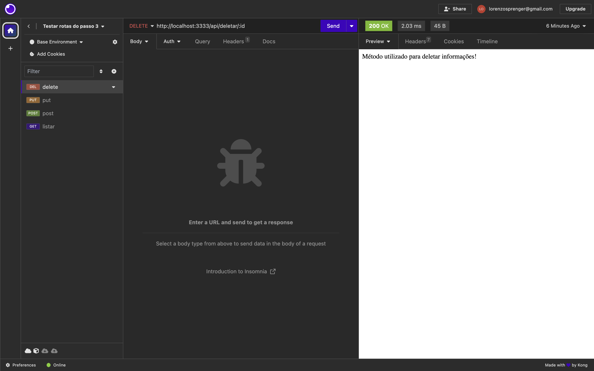
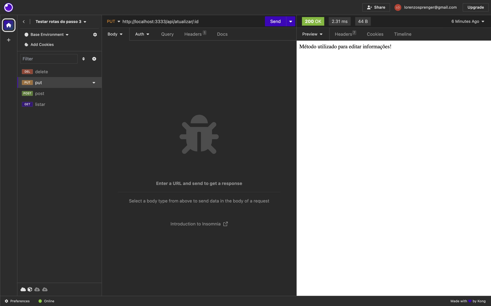
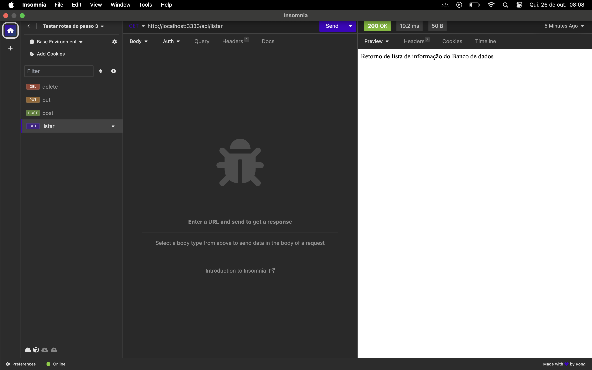
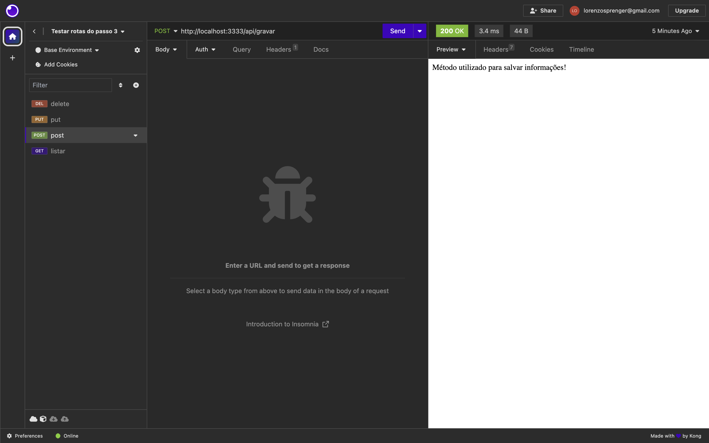

# 4º Passo: Testar rotas da API com o Insomnia

* Copiar url do repositório no gitHub
* Clonar repositório no computador com o gitBash
* Abrir o projeto no VSCode
* Aprender a utilizar o insomnia

<hr>

#### Clonar o repositório na sua máquina

* Abrir o gitBash em um local do computador
* Digitar o comando 'git clone' junto com a URL do seu repositório

```
git clone URL_REPOSITORIO
```


#### Acessar pasta
* Digitar o comando 'cd' e o nome do seu repositório
* cd (change directory): acessar outra pasta
```
cd NOME_REPOSITORIO
```


#### Reinstalar os pacotes da aplicação
```
npm i
```
* Este comando irá recriar a pasta node_modules no projeto

#### Recriar arquivo .env
* Definir as variáveis no arquivo .env a partir das chaves definidas no arquivo .env.example

#### Com o passo 3 finalizado podemos testar os endpoints (rotas) da API

## Insomnia

Quando você está criando sua API, vai precisar testar as rotas que serão criadas no projeto, é possível utilizar o próprio browser para testar, mas ele só pode enviar requisições do tipo get, e os dados retornados não são apresentados já formatados. Para usar as outras requisições como post, put e delete, será necessário usar softwares de terceiros, e nesse caso, é o insomnia. Ele é um programa open source feito em javascript. O programa é um testador de rotas para APIs, como todos os outros (por exemplo o postman), você coloca a url da API e o caminho da rota

#### Agora abra o insomnia no seu computador

* Vamos um novo projeto clicando no ícone indicado pela seta, conforme a imagem abaixo


* Agora precisamos dar um nome para esse projeto, a imagem a seguir sugere o nome 'Projeto API'
* Defina o nome do projeto e clique no botão 'Create'


* Com o projeto criado, precisamos criar uma coleção de requisições para esse projeto
* Clique no botão 'New Collection', conforme indicação da imagem a abaixo


* Agora precisamos dar um nome para essa coleção, a imagem a seguir sugere o nome 'Testar rotas do passo 3'
* Defina o nome da coleção e clique no botão 'Create'


* Agora estamos dentro do projeto 'Projeto API / Testar rotas do Passo 3'
* Vamos criar a primeira requisição para a API clicando no botão 'New HTTP Request', indicado na tela a seguir  
* Será criar uma nova requisição no método GET


* Todas as requisições desta coleção ficaram listadas neste quadro da esquerda conforme a imagem
* Podemos alterar o nome da requisição clicando no ícone de seta para baixo e selecionando a opção 'Rename'
* É importante renomear as requisições para deixarmos personalizadas e com a descrição de responsabilidade da requisição


* Podemos adicionar outras requisições clicando no ícone conforme imagem abaixo
* Por padrão a requisição é criada no método GET


* Podemos alterar o método da requisição clicando no íconde de seta para baixo, conforme a imagem abaixo


* Agora só precisamos descrever a url da nossa API com a porta que definimos (http://localhost:3000) e as rotas (/api/listar) que criamos no arquivo rotas.js do passo 3


## ATENÇÃO

#### Antes de clicar no botão 'Send' para executar a ação da rota, execute o comando 'npm start' no seu projeto para rodar a API e verifique se o retorno estará conforme a imagem a seguir, ou seja, rodando na porta definida para o servidor


* Após validar que a API esta rodando, executa a ação da rota clicando no botão 'Send'

* O Insomnia deverá retornar a mensagem descrita no método GET do nosso arquivo de rotas


## TAREFA

#### Criar as outras 3 requisições para os métodos POST, PUT e DELETE para exibir os conteúdos de cada método criado no arquivo de rotas da API

## Conclusão do Passo 4
#### URL do repositório com:
 * Estrutura do projeto 
 * Arquivo readme de documentação dos passos realizados
 * Configuração 
 * Retorno de teste da API
 * Arquivo de rotas com os métodos [GET, POST, PUT, DELETE]
 * Imagem de cada método testado no Insomnia dentro do arquivo readme, conforme exibido na conclusão do passo 4

#### Enviar a URL na tarefa do teams
 * Tarefa 4 - Testando rotas com insomnia

<hr>

## Tela do método DELETE


## Tela do método PUT


## Tela do método GET


## Tela do método POST
